# cifarSOTA

Reviewing recent advances in classification on CIFAR 10 and 100 datasets

# Table of Contents
1. [Stochastic Weight Averaging](#stochasticweightaveraging)
2. [Example2](#example2)
3. [Third Example](#third-example)

## Stochastic Weight Averaging

[paper](https://arxiv.org/abs/1803.05407) | [pytorch](https://github.com/timgaripov/swa) | 

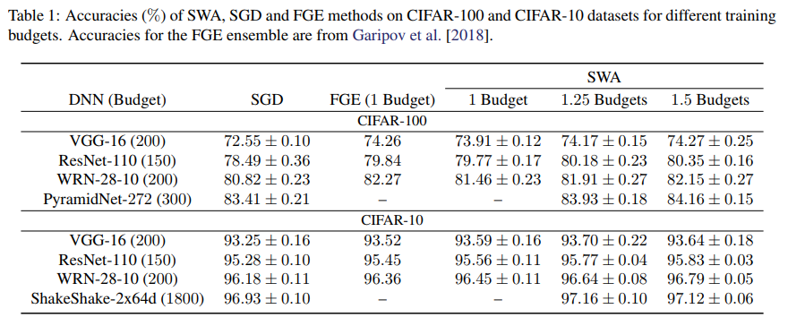

## Born again networks

[paper](http://metalearning.ml/papers/metalearn17_furlanello.pdf) |  

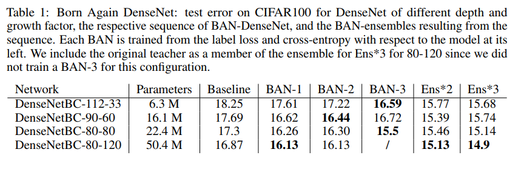

## Erase ReLU

[paper](https://arxiv.org/pdf/1709.07634.pdf) |

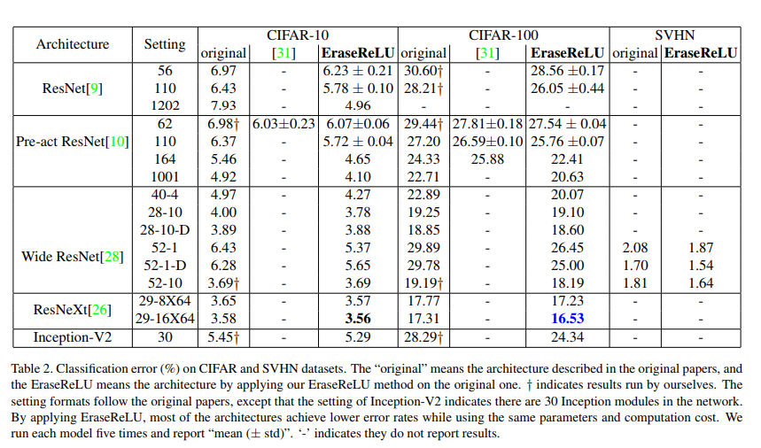

# Cyclic learning rates

[paper](https://arxiv.org/abs/1506.01186)

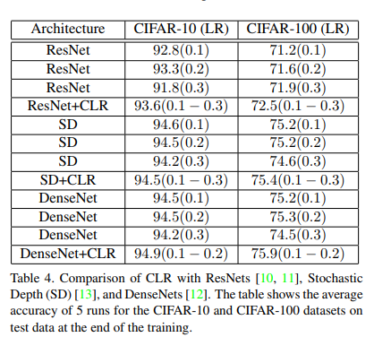

## Shake Drop

[paper](https://arxiv.org/abs/1802.02375) | [lua official](https://github.com/imenurok/ShakeDrop) | 

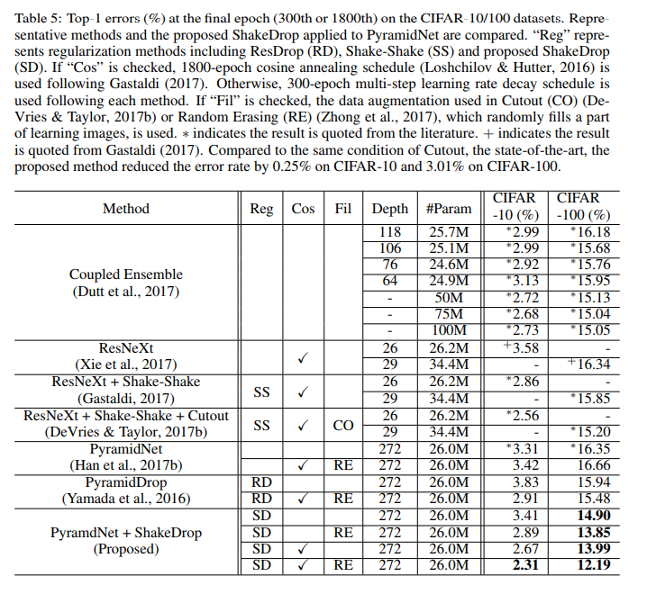

## Shake Shake

[paper](https://arxiv.org/abs/1705.07485) | [lua official](https://github.com/xgastaldi/shake-shake) | [pytorch](https://github.com/hysts/pytorch_shake_shake) | 

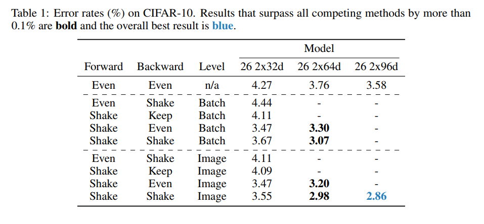

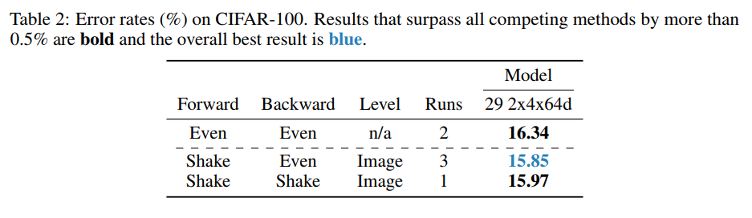

## mixup 

[paper](https://arxiv.org/abs/1710.09412) | [pytorch official](https://github.com/hongyi-zhang/mixup) | 

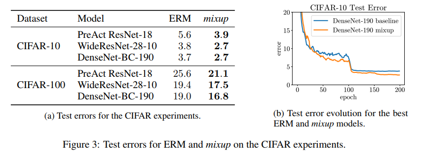

## Cutout

[paper](https://arxiv.org/abs/1708.04552) | [pytorch official](https://github.com/uoguelph-mlrg/Cutout) |

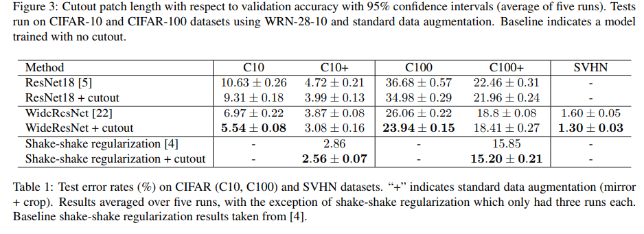

## Random erasing

[paper](https://arxiv.org/abs/1708.04896) | [pytorch official](https://github.com/zhunzhong07/Random-Erasing) |

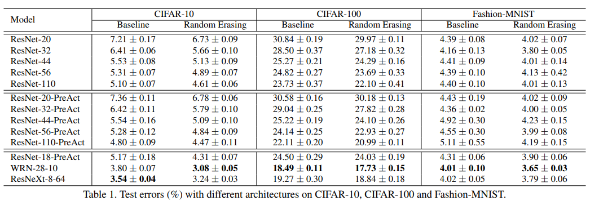

# SGDR

[paper](https://arxiv.org/abs/1608.03983) | [official](https://github.com/loshchil/SGDR)

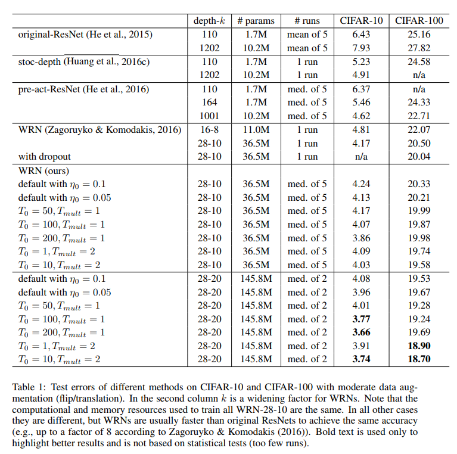
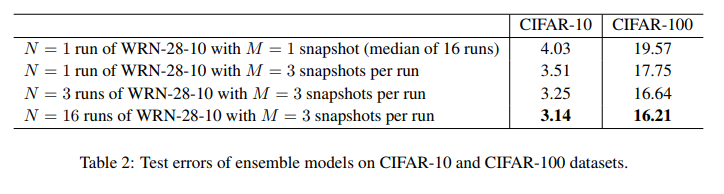
# Densenets

[paper](https://arxiv.org/abs/1608.06993) | [official](https://github.com/liuzhuang13/DenseNet)

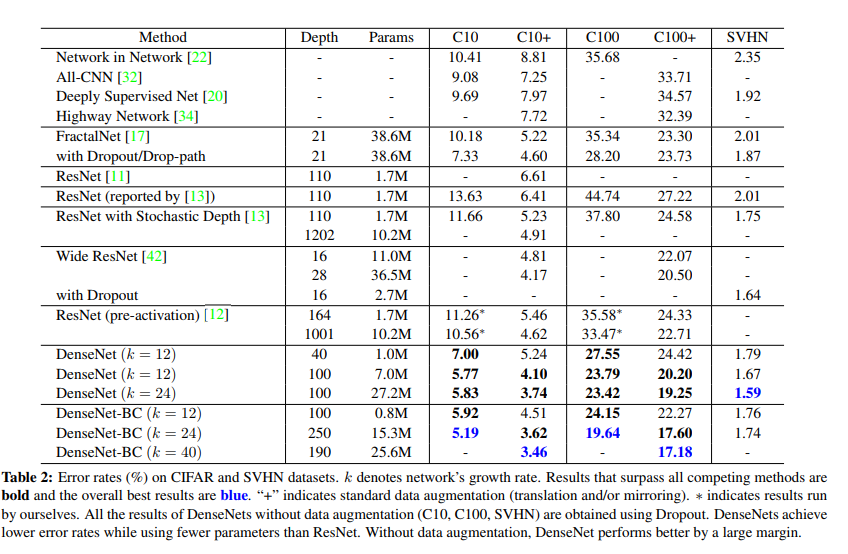

# Pyramid drop

[paper](https://arxiv.org/pdf/1707.07074.pdf)

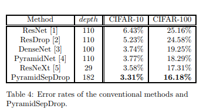

# Pyramid Resnet

[paper](https://arxiv.org/abs/1610.02915)

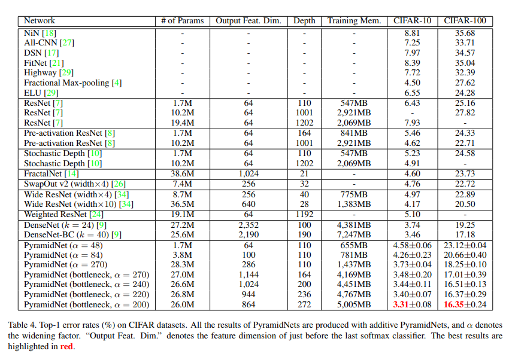

# ResNext

[paper](https://arxiv.org/abs/1611.05431)

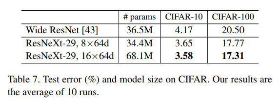

# Wide Resnet

[paper](https://arxiv.org/abs/1605.07146)

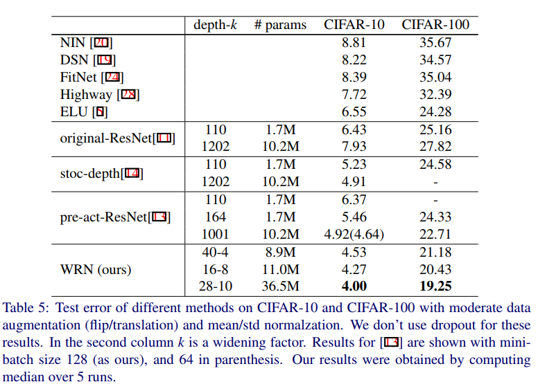

# Preact Resnet

[paper](https://arxiv.org/abs/1603.05027) |

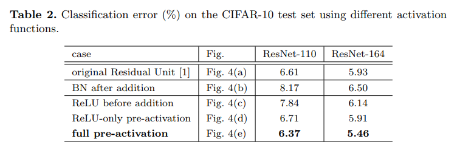

# Stochastic depth Resnets

[paper](https://arxiv.org/abs/1603.09382) | [official](https://github.com/loshchil/SGDR)

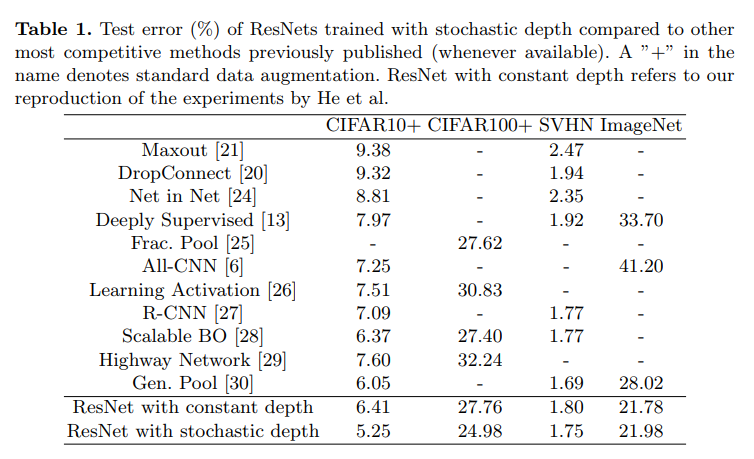

# Resnet

[paper](https://arxiv.org/abs/1512.03385)

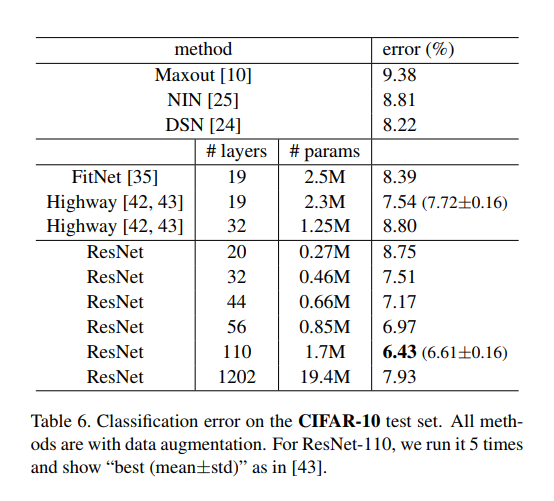

